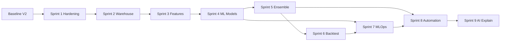

# Headcrack AI — Locked Sprint Plan

**Status:** Locked  
**Focus sport:** Soccer (primary)  
**Execution model:** 9 sequential sprints, ~31–36k LOC total  
**Baseline:** V0–V2 prototype (Poisson engine, live odds, tracking, calibration reports, dashboard)

This document is the canonical build plan. When in doubt, ship the current sprint’s exit criteria before starting the next.

---

## Sprint map

| Sprint | Goal | Size | Depends on |
| ------ | ---- | ---- | ---------- |
| **Sprint 1** | Production hardening (CI, Docker, logging, config, Alembic, retries) | ~2–3k LOC | Baseline |
| **Sprint 2** | Historical warehouse & normalized database | ~3–5k LOC | Sprint 1 |
| **Sprint 3** | Feature engineering pipeline | ~4k LOC | Sprint 2 |
| **Sprint 4** | Classical ML models (LightGBM / XGBoost / CatBoost) | ~5k LOC | Sprint 3 |
| **Sprint 5** | Ensemble engine + calibration | ~3k LOC | Sprint 4 |
| **Sprint 6** | Backtesting engine | ~4k LOC | Sprint 5 |
| **Sprint 7** | MLOps (DVC / MLflow, training, registry, evaluation, deployment) | ~5k LOC | Sprint 4–6 |
| **Sprint 8** | Daily automation, reporting, APIs | ~3k LOC | ✅ Scaffolded |
| **Sprint 9** | AI explanation layer | ~2k LOC | Partial (Sprint 9 baseline exists) |

---

## Pre-sprint baseline (already shipped)

What exists today in `headcrack_ai/`:

| Area | Module(s) | Sprint it feeds |
| ---- | --------- | --------------- |
| Domain models & odds math | `models.py`, `probability.py`, `bankroll.py` | 4–6 |
| Soccer Poisson + live enrichment | `soccer.py`, `shot_model.py` | 4–5 |
| Parlay optimizer | `optimizer.py`, `explain.py` | 6, 8 |
| SQLite persistence | `persistence.py` | 1 → 2 (migrate) |
| Manual + live odds intake | `ingest.py`, `providers/odds_api.py`, `services.py` | 2, 8 |
| Feature store (local) | `feature_store.py` | 2 → 3 |
| Bet tracking & settlement | `results.py`, `reports.py` | 6, 8 |
| Calibration reports | `calibration.py` | 5, 7 |
| Daily report + plain language | `daily_report.py`, `plain_language.py`, `llm_explain.py` | 8, 9 |
| CLI + Streamlit dashboard | `cli.py`, `dashboard.py` | 1, 8 |

**Known gaps before Sprint 1:** no CI, no Docker, no structured logging, no Alembic/Postgres, no API retries, SQLite lock issues under concurrent dashboard + CLI.

---

## Sprint 1 — Production hardening

**Goal:** Make the repo deployable, testable, and operable in production.

### Deliverables

- **CI** — GitHub Actions: lint, `pytest`, type-check (optional), coverage gate on `headcrack_ai/`
- **Docker** — `Dockerfile` + `docker-compose.yml` (app + Postgres optional profile)
- **Logging** — structured JSON logs, request/CLI correlation IDs, log levels via env
- **Config** — pydantic-settings or frozen config schema; secrets only from env; `.env.example` validated
- **Alembic** — migration scaffold; initial revision from current SQLite schema
- **Retries** — exponential backoff for Odds API, idempotent fetch jobs, SQLite WAL + connection pooling fix
- **Health** — `/health` and `/ready` endpoints (FastAPI or Flask internal API)

### Exit criteria

- [ ] `docker compose up` runs dashboard + Postgres
- [ ] CI green on PR to `main`
- [ ] `alembic upgrade head` creates schema on fresh Postgres
- [ ] Live odds fetch survives transient API failures without corrupting DB
- [ ] No `database is locked` under dashboard + CLI concurrent use

### Key paths (new)

```text
.github/workflows/ci.yml
Dockerfile
docker-compose.yml
headcrack_ai/logging.py
headcrack_ai/settings.py          # pydantic-settings wrapper
alembic/
headcrack_ai/db/                   # SQLAlchemy models + session
headcrack_ai/http/retry.py
```

---

## Sprint 2 — Historical warehouse & normalized database

**Goal:** Replace ad-hoc SQLite tables with a normalized soccer data warehouse.

### Deliverables

- **Postgres warehouse** — canonical schema for soccer
- **ETL ingestors** — odds snapshots, results, lineups, player/team game logs
- **Dimension tables** — `leagues`, `teams`, `players`, `matches`, `seasons`
- **Fact tables** — `match_results`, `player_match_stats`, `team_match_stats`, `odds_snapshots`, `market_prices`
- **Data quality** — uniqueness constraints, stale-row detection, ingest audit log
- **Migration path** — SQLite → Postgres one-way export tool

### Schema (target)

```text
leagues, seasons, teams, players, matches
player_match_stats, team_match_stats
odds_snapshots, market_prices
predictions, bet_legs, bet_records, market_results
ingest_runs, ingest_errors
```

### Exit criteria

- [ ] Historical EPL + MLS sample data loaded reproducibly
- [ ] Odds API snapshots append-only with dedupe by `(market_id, captured_at)`
- [ ] Feature store reads from warehouse, not raw CSV
- [ ] Dashboard value board backed by Postgres

### Key paths (new)

```text
headcrack_ai/warehouse/schema.sql
headcrack_ai/warehouse/models.py
headcrack_ai/warehouse/etl/odds.py
headcrack_ai/warehouse/etl/results.py
headcrack_ai/warehouse/etl/player_logs.py
scripts/migrate_sqlite_to_postgres.py
```

---

## Sprint 3 — Feature engineering pipeline

**Goal:** Reproducible rolling features for every soccer market type we bet.

### Deliverables

- **Feature registry** — named features with version, owner, freshness SLA
- **Rolling builders** — team form, xG proxies, shots/corners/cards rates, rest days, home/away splits
- **Player features** — shots, SOT, goals, minutes, opponent defensive rates
- **Match context** — implied totals from books, line movement delta
- **Materialization** — daily + pre-kickoff feature snapshots keyed by `(match_id, as_of)`
- **CLI** — `build-features --league soccer_epl --as-of 2026-07-09`

### Exit criteria

- [ ] Feature parquet/DB tables generated for 10+ matches without manual steps
- [ ] Shot model consumes warehouse features, not inline SQL
- [ ] Feature drift report (null rate, min/max, row count) on every run
- [ ] Unit tests for 20+ core feature definitions

### Key paths (new)

```text
headcrack_ai/features/registry.py
headcrack_ai/features/builders/team_form.py
headcrack_ai/features/builders/player_shots.py
headcrack_ai/features/builders/market_context.py
headcrack_ai/features/materialize.py
```

---

## Sprint 4 — Classical ML models

**Goal:** Trainable models that beat book baseline on held-out soccer markets.

### Deliverables

- **Model families** — LightGBM, XGBoost, CatBoost (start with one, interface for all)
- **Targets** — moneyline (3-class), totals over/under, BTTS, player shots 1.5/2.5
- **Training pipeline** — time-based splits (no leakage), hyperparameter search, feature importance export
- **Prediction API** — `Model.predict(match_id, market_type) -> Prediction`
- **Baseline comparison** — always log book implied prob vs model prob

### Exit criteria

- [ ] At least 3 market types with trained models on historical data
- [ ] Hold-out Brier score beats book baseline on 2+ market types
- [ ] Models write predictions to warehouse with `model_name`, `model_version`, `features_hash`
- [ ] Live odds flow uses ML predictions instead of Poisson-only when model exists

### Key paths (new)

```text
headcrack_ai/ml/datasets.py
headcrack_ai/ml/trainers/lightgbm_trainer.py
headcrack_ai/ml/trainers/xgboost_trainer.py
headcrack_ai/ml/predictors/soccer_markets.py
models/registry/                    # serialized model artifacts
```

---

## Sprint 5 — Ensemble engine + calibration

**Goal:** Combine models safely and measure whether probabilities are trustworthy.

### Deliverables

- **Ensemble** — weighted blend of Poisson, ML, and book anchor with configurable weights per market
- **Calibration layer** — isotonic / Platt scaling fit on validation fold
- **Reliability tooling** — ECE, Brier, log loss by market type and confidence bucket
- **Promotion rules** — only deploy calibrated models that beat baseline on validation
- **Dashboard tab** — “Model trust” with plain-English reliability charts

### Exit criteria

- [ ] Ensemble Brier ≤ best single model on validation
- [ ] Calibrated probabilities exported to value board
- [ ] Auto-fallback to Poisson when ML model stale or missing
- [ ] Calibration report runs nightly on settled picks

### Key paths (new)

```text
headcrack_ai/ensemble/blender.py
headcrack_ai/ensemble/calibrators.py
headcrack_ai/ensemble/promotion.py
```

---

## Sprint 6 — Backtesting engine

**Goal:** Prove edge and ROI before risking real money.

### Deliverables

- **Walk-forward backtest** — train on past, bet on next window, roll forward
- **Slippage & vig** — configurable book margin, line movement penalty
- **Strategies** — flat stake, fractional Kelly, edge thresholds, max daily exposure
- **Reports** — ROI, drawdown, hit rate, CLV proxy, Sharpe-like metrics per market
- **CLI** — `backtest --league soccer_epl --from 2024-01-01 --to 2025-06-01`

### Exit criteria

- [ ] Backtest runs end-to-end on 1+ full season of data
- [ ] Outputs match manual spot-checks on 10 random bets
- [ ] Parlay backtest mode (correlation-aware) documented with limitations
- [ ] Results stored for comparison across model versions

### Key paths (new)

```text
headcrack_ai/backtest/engine.py
headcrack_ai/backtest/strategies.py
headcrack_ai/backtest/metrics.py
headcrack_ai/backtest/report.py
```

---

## Sprint 7 — MLOps

**Goal:** Repeatable training, versioning, evaluation, and deployment.

### Deliverables

- **DVC** — data + feature versioning, pipeline stages
- **MLflow** — experiment tracking, model registry, artifact store
- **Training orchestration** — scheduled retrain (weekly), triggered by data freshness
- **Evaluation gates** — block promotion if Brier/ECE/ROI thresholds fail
- **Deployment** — load active model version at app startup; hot-swap without restart (optional)

### Exit criteria

- [ ] `dvc repro` rebuilds features + trains model from raw ingest
- [ ] MLflow UI shows last 10 experiments with metrics
- [ ] Production config points to `model_version` in registry
- [ ] Rollback to prior model version in < 5 minutes

### Key paths (new)

```text
dvc.yaml
params.yaml
mlflow/
headcrack_ai/mlops/train.py
headcrack_ai/mlops/evaluate.py
headcrack_ai/mlops/deploy.py
```

---

## Sprint 8 — Daily automation, reporting, APIs

**Goal:** Hands-off daily soccer workflow.

### Deliverables

- **Scheduler** — pre-match odds pull, feature build, predict, card build, report send
- **REST API** — `/v1/matches`, `/v1/value-board`, `/v1/cards`, `/v1/results`
- **Daily report** — markdown + JSON + optional email/Telegram/Discord
- **Automation hooks** — GitHub Action or cron container for `daily-soccer` job
- **Idempotent jobs** — safe to re-run on same match day

### Exit criteria

- [ ] One command produces full daily soccer card from live odds + ML ensemble
- [ ] API documented with OpenAPI spec
- [ ] Report delivered automatically on match days (configurable channel)
- [ ] All jobs logged with `job_id` and status in warehouse

### Key paths (new)

```text
headcrack_ai/api/app.py
headcrack_ai/jobs/daily_soccer.py
headcrack_ai/jobs/fetch_odds.py
headcrack_ai/jobs/settle_bets.py
.github/workflows/daily-soccer.yml    # optional scheduled workflow
```

---

## Sprint 9 — AI explanation layer

**Goal:** Turn model output into advice anyone can understand.

### Deliverables

- **Explanation service** — structured brief per card: best singles, parlays, warnings, confidence
- **Grounded LLM** — only narrate facts from model output (no hallucinated stats)
- **Template fallback** — offline plain-English (extend `plain_language.py` + `llm_explain.py`)
- **Per-pick rationale** — “why this bet” from SHAP top features + game script tags
- **Safety rails** — bankroll reminders, no-guarantee language, responsible gambling footer

### Exit criteria

- [ ] Every daily card includes plain-English + optional LLM narrative
- [ ] LLM prompt includes only JSON facts from ensemble output
- [ ] Feature-attribution one-liner on top 5 value picks
- [ ] A/B: template vs LLM readability review (informal checklist)

### Key paths (extend)

```text
headcrack_ai/llm_explain.py           # extend
headcrack_ai/plain_language.py        # extend
headcrack_ai/explain/attribution.py   # new
headcrack_ai/explain/card_brief.py    # new
```

---

## Cross-sprint principles

1. **Soccer first** — every sprint defaults to soccer markets; other sports are out of scope until Sprint 8+.
2. **Book baseline always visible** — never hide implied probability; edge is the product.
3. **No silent model swaps** — every prediction carries `model_name` + `model_version`.
4. **Plain English at the edge** — CLI/dashboard/report outputs stay human-readable (Sprint 9 extends, not replaces).
5. **Small PRs** — target reviewable chunks inside each sprint; don’t land 5k LOC in one PR.
6. **Tests follow features** — each sprint adds integration tests for its exit criteria.

---

## Dependency graph



---

## Immediate next action

**Start Sprint 1.** First PR slice:

1. GitHub Actions CI running `pytest tests/`
2. `Dockerfile` + `docker-compose.yml` with Postgres
3. SQLite WAL fix + single shared connection pattern (unblocks live odds + dashboard)
4. Structured logging in `services.fetch_live_legs` and CLI commands

---

## Revision history

| Date | Change |
| ---- | ------ |
| 2026-07-09 | Sprint plan locked (9 sprints, soccer focus) |
